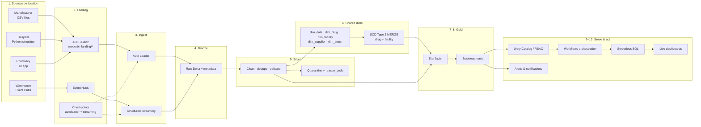
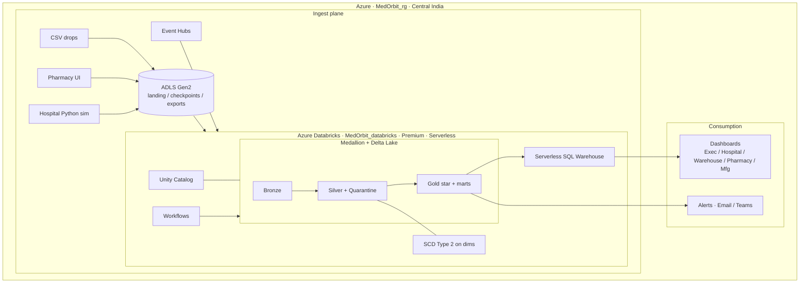

# MedOrbit — End-to-End Project Flow

**Pharmaceutical Supply Chain Intelligence Platform**  
Databricks Lakehouse · Medallion (Bronze → Silver → Gold) · Live dashboards & alerts  

**Infra (current):** `MedOrbit_rg` · ADLS `medorbitadls6666` · Databricks `MedOrbit_databricks` · Central India · Premium + serverless · No ADF  

**Diagrams in this folder:**
- `MedOrbit_Architecture.png` — total architecture
- `MedOrbit_E2E_Flow.png` — numbered end-to-end flow

---

## 1. Business problem (why this flow exists)

Hospitals, pharmacies, warehouses, and manufacturers track stock in separate systems. There is no unified answer to:

> Do we have the **right medicine**, in the **right quantity**, at the **right location**, at the **right time**?

The platform unifies those sources, enforces quality and history, and surfaces shortage / expiry / demand insight on live dashboards with alerts.

---

## 2. Physical locations & what data each produces

| Location | What it represents | Example entities / events |
|---|---|---|
| **Manufacturer** | Plants producing drug batches | Production lots, batch IDs, quantities, expiry-at-source, supplier linkage |
| **Warehouse** | Regional stock hubs that **supply** hospitals/pharmacies | Stock movements, on-hand, shipments, `warehouse_serves` links |
| **Hospital** | Care sites with inventory + clinical demand | On-hand stock, consumption, **prescriptions**, projected need |
| **Pharmacy** | Retail / outpatient dispensing | Dispenses, sales, on-hand, velocity / top sellers |

Shared master concepts (used everywhere): **drug**, **facility**, **supplier**, **batch**, **date/calendar**.

---

## 3. How data enters the platform (multi-modal ingest)

| Location | Ingest method | Landing target | Databricks technique |
|---|---|---|---|
| Manufacturer | **CSV files** dropped to ADLS | `medorbit-landing/manufacturer/` | **Auto Loader** → Bronze |
| Warehouse | **Azure Event Hubs** (stream) | Stream into Bronze (checkpoints under `medorbit-checkpoints/streaming/`) | **Structured Streaming** |
| Hospital | **Python simulator** writing files/events | `medorbit-landing/hospital/` (and/or Event Hub) | Auto Loader and/or streaming |
| Pharmacy | **Simple UI app** (sale/dispense entry) | Writes to landing path or API → storage | Micro-batch / Auto Loader |
| Shared masters | Seed CSVs (contract) | `medorbit-landing/shared-dims/` | Batch load → dimension tables |

Also used:
- **`medorbit-checkpoints/autoloader/`** — Auto Loader checkpoint & schema location  
- **`medorbit-exports/`** — optional curated extracts for external tools  

---

## 4. Total end-to-end flow (steps)

```text
Sources (4 locations, 4 ingest styles)
    → Land in ADLS Gen2 (by folder) + Event Hubs
    → Ingest (Auto Loader / Structured Streaming)
    → Bronze Delta (raw as-is + ingest metadata)
    → Silver Delta (clean, dedupe, validate)
         ↳ Quarantine (bad rows + reason_code)     [branch]
    → Shared dimensions (incl. SCD Type 2 MERGE)
    → Gold facts (star) + business marts
    → Unity Catalog governance / RBAC
    → Databricks Workflows (orchestrate child → master)
    → Serverless SQL Warehouse
    → Live dashboards (5 pages) + Notifications / alerts
```

### Step-by-step

| # | Step | What happens | Tools / techniques |
|---|---|---|---|
| **0** | **Contract & seeds** | Freeze shared keys (`drug_id`, `facility_id` prefixes `HSP_/PHM_/WHS_/MFG_`, `supplier_id`, `batch_id`, UTC timestamps). Publish seed dims. | ADLS `shared-dims`, data contract |
| **1** | **Produce / capture source data** | Manufacturer CSVs; warehouse events; hospital sim (stock + Rx); pharmacy UI transactions. | CSV, Event Hubs, Python, UI app |
| **2** | **Land raw payloads** | Files under location folders; events on hub; checkpoints ready. | ADLS Gen2, Event Hubs |
| **3** | **Ingest to Bronze** | Incremental file discovery; stream processing with checkpointing; schema inference/evolution as designed. | **Auto Loader**, **Structured Streaming**, Delta |
| **4** | **Bronze layer** | Raw copy **as-is** + `_ingest_ts`, source path/event id, load run id. No business cleansing. | Delta tables, UC `bronze` schema |
| **5** | **Silver layer** | Standardize types/codes, dedupe, join to masters, validate business rules, handle late data where needed. | Spark/SQL, DQ rules |
| **5b** | **Quarantine** | Invalid rows **not deleted** — written to quarantine tables with `reason_code` for ops review. | Quarantine tables in UC |
| **6** | **Shared dimensions** | Build/refresh `dim_date`, `dim_drug`, `dim_facility`, `dim_supplier`, `dim_batch`. | Delta MERGE |
| **6b** | **SCD Type 2** | History tracking on slowly changing attrs (e.g. drug strength/status, facility type/region) via MERGE (`valid_from` / `valid_to` / `is_current`). | **SCD2** |
| **7** | **Gold facts (star)** | Numeric events keyed to dimension surrogate/business keys. | Star schema |
| **8** | **Gold business marts** | Dashboard-ready aggregates: shortage, days-of-cover, expiry risk, velocity, seasonal vs projected need, exec KPIs. | Gold tables / views |
| **9** | **Governance** | Catalog + schemas; roles (admin / engineer / viewer); lineage via UC; least privilege for evaluators on Gold. | **Unity Catalog**, RBAC |
| **10** | **Orchestration** | Parallel domain/child pipelines → shared dims/gold → notify. Idempotent reruns. | **Databricks Workflows / Lakeflow** |
| **11** | **Serve** | Query marts via **serverless SQL warehouse** (stop when idle). | Serverless SQL |
| **12** | **Visualize** | Multi-page live dashboard: Executive · Hospital · Warehouse · Pharmacy · Manufacturing. | Databricks Lakeview and/or Power BI |
| **13** | **Alert** | Threshold breaches (critical shortage, expiry window, days-of-cover low) → email / Teams webhook. | **Notifications & alerts** |

**Medallion rule:** each layer only reads the layer before it. If a Gold number looks wrong, trace Gold → Silver → Bronze → source.

---

## 5. Flow diagram (Mermaid)



---

## 6. Architecture diagram (Mermaid)



---

## 7. Data model

### 7.1 Shared dimensions

| Dimension | Grain | Notes |
|---|---|---|
| `dim_date` | One row per calendar day | Fiscal/season flags for “last year this season” |
| `dim_drug` | One current version per drug (+ history rows) | **SCD2** |
| `dim_facility` | Hospital / pharmacy / warehouse / plant | Type + region; **SCD2** |
| `dim_supplier` | Supplier master | Linked from manufacturer |
| `dim_batch` | Lot / batch | Expiry, drug_id (optional light snowflake under drug) |

### 7.2 Fact tables (star)

| Fact | Typical measures | Driven by location |
|---|---|---|
| `fact_production` | qty produced | Manufacturer |
| `fact_stock_movements` | qty in/out, on-hand delta | Warehouse (+ others) |
| `fact_shipments` | qty shipped, status, ETA | Warehouse |
| `fact_prescriptions` | Rx lines, qty prescribed | Hospital |
| `fact_hospital_consumption` | qty consumed | Hospital |
| `fact_dispenses` / `fact_pharmacy_sales` | qty sold/dispensed | Pharmacy |

### 7.3 Gold business marts (dashboard-ready)

| Mart | Business question |
|---|---|
| `mart_exec_summary` | Network stock health, critical shortages, expiry $ at risk |
| `mart_days_of_cover` | How many days can a **hospital** manage on current stock? |
| `mart_expiry_risk` | Which batches need attention soon? |
| `mart_warehouse_velocity` | Most moved/sold-through drugs; qty now; who warehouse serves |
| `mart_pharmacy_top_sellers` | Top drugs per pharmacy; stock vs velocity |
| `mart_projected_need` | This week need (Rx-based) vs on-hand; seasonal last-year compare |
| `mart_seasonal_demand` | Last year this season — top drug / volume |

Control table (optional): ingestion watermark / pipeline run control (~+1 table beyond pure dims/facts/marts).

---

## 8. Techniques checklist (must-show in the project)

| Technique | Where in the flow |
|---|---|
| **Auto Loader** | Manufacturer (and file-based hospital/pharmacy) → Bronze |
| **Structured Streaming** | Warehouse Event Hubs → Bronze/Silver |
| **Medallion architecture** | Bronze → Silver → Gold |
| **Quarantining** | Silver DQ failures |
| **SCD Type 2** | `dim_drug`, `dim_facility` |
| **Star schema** | Gold dims + facts |
| **Unity Catalog / data governance** | Catalog, schemas, RBAC, lineage |
| **Databricks Workflows** | Master orchestration of child pipelines |
| **Serverless compute** | Notebooks, jobs, SQL warehouse |
| **Notifications & alerts** | Thresholds on Gold marts |
| **Multi-modal ingest** | CSV + Event Hub + Python + UI |
| **Live dashboards** | 5 location/exec pages |

---

## 9. Dashboard pages (what “done” looks like visually)

1. **Executive** — overall stock health, critical shortages, expiry risk  
2. **Hospital** — on-hand, **days of cover**, Rx-driven **projected need vs stock**, last-year season top drug  
3. **Warehouse** — top movers, quantity now, supply links to hospitals/pharmacies  
4. **Pharmacy** — top sellers, stock-out risk, UI-entered sale story  
5. **Manufacturing** — batches produced, supply into warehouses, expiry-at-source risk  

Shared filters: drug · facility · date (same dimension keys).

---

## 10. One-line story for demos

> Four location sources land via files, streams, scripts, and a UI → Auto Loader & Streaming fill Bronze → Silver cleans and quarantines → SCD2 dims + star facts build Gold marts under Unity Catalog → a Workflow refreshes everything → Serverless SQL powers live dashboards and shortage/expiry alerts.

---

*Document for MedOrbit capstone planning. Team task split is intentionally omitted here.*
